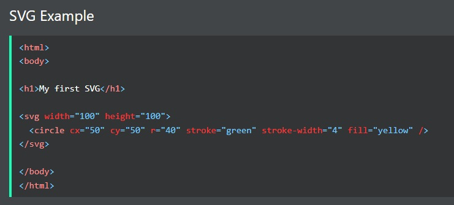
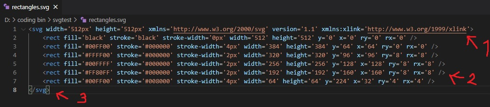
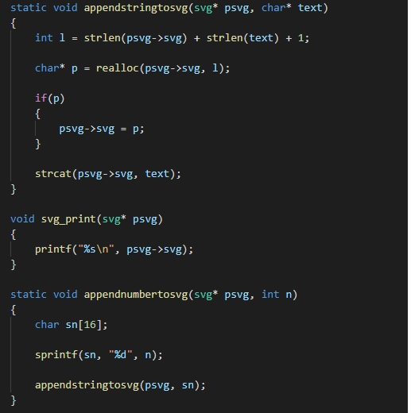
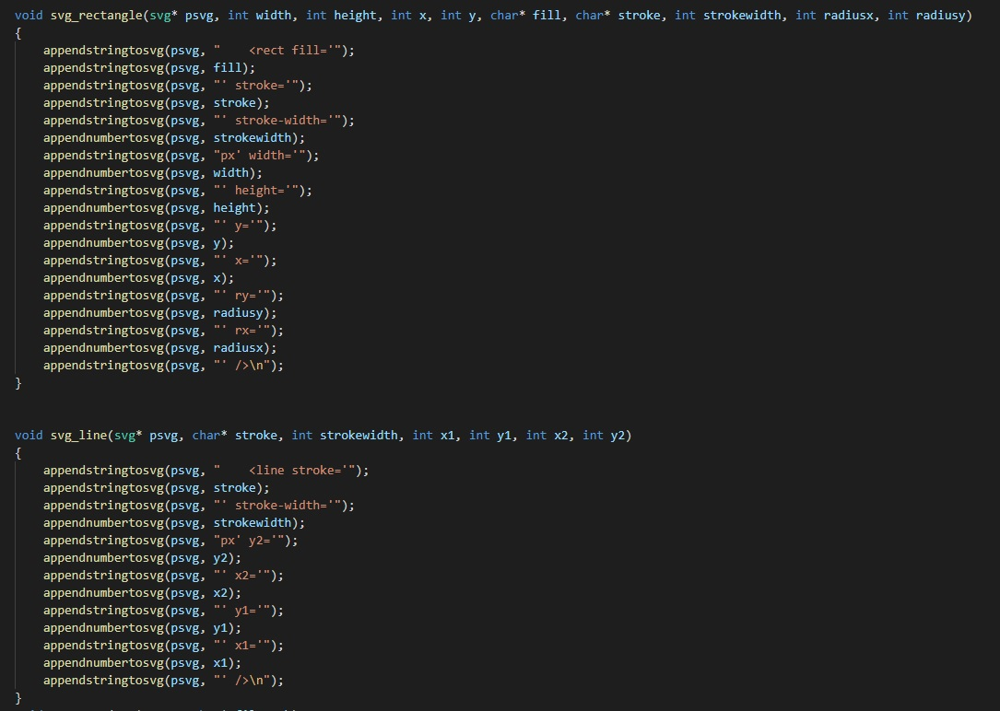

# Vector Graphics Manipulator 
* Phobphoomin Siriboon 64011548 
* Please see Description and Documentation for the algorithm.
## Description:
The program generates a Scalable Vector Graphic file/document from designated format consisting of coordinates,shapes and color by
* Creating a file with file I/O then saving it as a svg format later.
* Defining the core function to write **XML Open Tag Shape Size Color Object and closing the tag**
* Making a sub function to call the core function in order to write the data we want and **draw** the **object** we want
## Documentation: 
* **An Example Of An SVG File's Data**

* **So basically if we can create a file and write string and numbers into it then we can create an SVG file as you can see NUMBER 1 is the starting tag NUMBER 2 is the body and NUMBER 3 is the closing tag.**

 

* **These core functions right here write string and numbers into the document.**

* **Sub functions that make call to the core function in order to write the BODY which is the main information of the svg file.**

## Instruction: 
the example program is in the main.c in order to compile the example just download the files and include the header, no external libary is needed except for the svg header file which contains svg and files function. Once you compile the code a file will be generated in the same folder as in the main.c.

ALternatively you can run the main executable program.

**NOTE**: svg.c is the same as main.c but I was playing around with it. 
Also there seems to be several files, this is due to the fact that I've also uploaded codeblocks project file.
 

## Reference:
* Simple SVG libary in c from codedrome  
